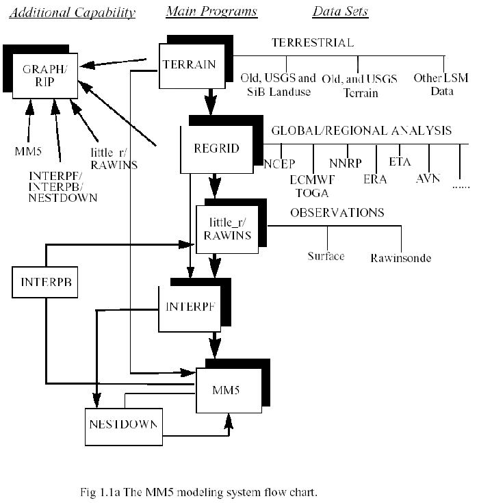

# 使用 MM5 的事前準備

<p>　　首先第一步當然是到他們的網站：[http://www.mmm.ucar.edu/mm5/](http://www.mmm.ucar.edu/mm5/) 下載 MM5 主程式的壓縮檔啦，在下載頁面你可能會看到一大堆的壓縮檔，看是要在工作站上用 ```wget```這個指令抓，或者是要在自己的電腦下載好後用 FTP 傳上自己的資料夾都可以。

先來稍微解說一下這些壓縮檔是作什麼用的：

| 檔名              | 簡述                                                        | 使用場合 |
| --                | --                                                          | -- |
| INTERPB.tar.gz    | 將 σ 座標下的氣象資料內插回 P 座標                          | A, b |
| INTERPF.tar.gz    | 將 P 座標下的氣象資料內插到模擬用的σ 座標                   | A, b |
| LITTLE_R.tar.gz   | 利用地面、探空觀測資料進行客觀分析,生成初始客觀分析場       | a, b |
| MM5.tar.gz        | 主程式                                                      | 2:5 |
| MM5toGrADS.tar.gz | 將輸出檔轉成轉換為 GrADS 繪圖格式之程式                     | 2:6 |
| MPP.tar.gz        | 平行化套件                                                  | 2:7 |
| NESTDOWN.tar.gz   | 將較粗網格的 σ 座標下的氣象資料內插至較細的網格             | 2:8 |
| RAWINS.tar.gz     | 讀入經 REGRID 處理後的資料以及觀測資料，並利用客觀分析將其結合在一起後輸出 P 座標下的氣象資料  | 2:9 |
| REGRID.tar.gz     | 讀取在 P 座標上的氣象分析資料後將其內插至模擬所需之網格點上 | 2:10 |
| RIP4.tar.gz       | RIPv4 繪圖程式  | 2:11 |
| TERRAIN.tar.gz    | 製作模擬所需之地形、地表資料                                | 2:12 |
| 0:13              | 1:13 | 2:13 |


