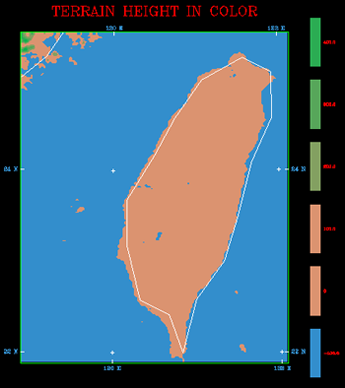

# 附錄 - 進階修改：修改 MM5 地形高度（地形敏感度測試）

**以下的修改皆需要動到 MM5 內的 Fortran 程式碼，請三思而後行，此外修改後記得要重新編譯來讓變更生效。**

在進行數值實驗時，常常會藉由修改地形高度來檢驗一個天氣系統的變化，大概每一篇颱風模擬的 Paper 都會出現一個關於地形敏感度實驗的章節。

## TERRAIN 地形製作流程：
1. 主程式 terrain.F 呼叫 TERDRV 這個副程式
2. 在 terdrv.F 中，根據所設定的網域大小，計算所需維度並讀入地形資料
3. 接著會 CALL CRLWMSK 製作 Land-Water mask 來決定哪些點是水域，該遮罩變數名稱為 FORCETER，值 9E9 代表陸地，而 0.001 則代表水域
4. 最後程式將會 CALL CRTER 呼叫副程式來製作地形檔

## 修改地形高度
可以從 crter.F 中下手修改地形高度，在這裡地形高度的變數名稱為 HT，只要在 return 前寫個判斷式修改指定經緯度範圍 XLON/XLAT 內的 HT 即可。比如說將地形高度通通乘上一個係數像是 0.25、0.5 等等，來進行地形高度對模擬結果的數值敏感度實驗。

以下是一個比較簡單的範例，為了向下相容所以用77的格式撰寫：
    ```
    ! ===========================================================================
    ! = MM5 Terrain modification,
    ! = Insert me between "continue" (CRTER.171) and "return" (CRTER.174)
    ! = by Dennis and Cypresslin - https://github.com/Cypresslin
    ! ===========================================================================
    iActivate = 1
    factor = 0.0	! 1 - yes; 0 - no
    ! multiplier, 0.0 - no terrain; 50.0 - 50% terrain ... etc
    if ( iActivate .eq. 1 ) then
      do j = 1,JX
      do i = 1,IX
        ! Specify the area you want to modify
        if ( XLAT(i,j) .gt.  21.5  .and. XLAT(i,j) .lt.  25.5  .and.
   &         XLON(i,j) .gt. 119.95 .and. XLON(i,j) .lt. 122.02) then
          HT(i,j) = HT(i,j) * factor
        endif
      enddo
      enddo
    endif
    ```
以上程式碼會將一個方塊內的地形完全剷平，若if判斷式越詳盡，就越能處理不規則形狀的地形。結果如下（Full terrain vs. No terrain）：
 

要注意的是修改指定範圍內的地形時，要小心因為修改而造成的地形不連續面，這可能會產生異常的數值模擬結果。不過如果是修改整個臺灣的地形就比較沒這個問題，只要修改一個長方形範圍內的值就可以涵蓋整個臺灣。

## 移除陸地，進行 Ocean Run
如果是要把陸地變成海洋，那麼從 crlwmsk.F 修改 FORCETER 這個陸地-水域遮罩變數將陸地的遮罩移除，讓它的地表分類變成海洋會比較直接會比較直接。如此不但可將地形移除，也可改變 Land-Use 讓他變成水域。只要在 CRLWMSK.175 後加入範圍判斷式，將指定範圍內地形設定為水域 0.001 即可，如下：
    ```
    ! ===========================================================================
    ! = MM5 Land-Water mask modification,
    ! = Insert me between "ENDIF" (CRLWMSK.175) and "ENDDO" (CRLWMSK.176)
    ! = by Cypresslin - http://cypresslin.web.fc2.com/
    ! ===========================================================================
      iActivate = 1
      if ( iActivate .eq. 1 ) then
          ! Specify the area you want to modify
          if ( XLAT(i,j) .gt.  21.5  .and. XLAT(i,j) .lt.  25.5  .and.
     &         XLON(i,j) .gt. 119.95 .and. XLON(i,j) .lt. 122.02) then
            FORCETER(i,j) = 0.001
          endif
      endif
    ```
結果如下：
 

製作出 TERRAIN_DOMAIN# 檔之後，可以先透過 `idt` 看看產出的 TER.PLT 預覽圖看看效果是不是一如預期，或者是用 MM5toGrADS 把 TERRAIN_DOMAIN# 轉出來畫圖檢查正確性。
