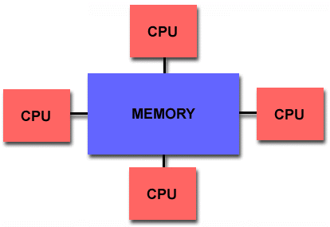

# 平行化運算 - OpenMP

被 MPPMM5 搞瘋了嗎？沒關係，這裡還有一個能夠讓 MM5 多核的跑法就是 OpenMP。它的平行方式是屬於共享式記憶體，也就是讓很多顆處理器使用本機上同一塊記憶體，如下圖：

其優點在於不用透過網路所以不會受網路傳輸速度的限制（高速的 Fibre channel switch 可不便宜啊！），而且因為是存取同一個記憶體區塊，所以在對記憶體區塊的存取較容易，不用透過網路所以也比較快。缺點則是你的編譯器得要有支援 OpenMP，在硬體擴充性上則是受到記憶體架構的限制，除了擴充不大容易之外也不能跨機器平行運算，使用越多處理器也不一定能增加效能。

參考：
* [OpenMP與MPI的差別 - 雜七雜八的kewang部落格](http://kewang.pixnet.net/blog/post/2959194)
* [Wikipedia - OpenMP](https://en.wikipedia.org/wiki/OpenMP)

## 編譯 OpenMP MM5

OpenMP 的使用方式相對來說簡單不少，不需要下載和安裝，只要 CPU 以及編譯器有支援就可以了。

1. **修改 MM5/configure.user**：  
   由於編譯器採用的是 PGI 的 pgf90，所以直接使用 [configure.user](http://www2.mmm.ucar.edu/mm5/On-Line-Tutorial/mm5/mm5.configure.user.html) 中 3i1 章節裡所提供的設定即可，請把那區塊的註解符號拿掉。特別要注意的是因為要用上 OpenMP，所以 FCFLAGS 跟 LDOPTIONS 要選用前面被加了兩個註解的那組，也就是選項中你會看到有個 "-mp" 的那兩個，對這些選項有興趣的話可以看看 pgf90 的 [man page](http://www.unix-info.org/Cluster_users/Compilers%20HOWTO/pgf90.html)。之後，就如同對單核心的設定一樣將基本的模式參數、物理參數設定完就可以了。
2. **編譯**：`make`
3. **製作並修改 mm5.deck**：`make mm5.deck`
4. **環境設定**：  
   OpenMP 是使用 csh 的環境，如果是使用其他環境的話可以用 `csh` 指令切過去，用 `exit` 可以離開 csh。切換到 csh 後，先用 `unlimit` 指令來嘗試使用最大可用的計算資源（此指令並非所有電腦都需要）再來是設定環境變數，先選擇你要使用幾個執行緒，假設是16個的話就是 `setenv OMP_NUM_THREADS 16`，接著設定一個記憶體堆疊區的大小 `setenv MPSTKZ 256M`（在大多數的電腦上256M為 MPSTKZ 的最大值）若在執行時遇上 segmentation fault 的問題，可以嘗試調整這個變數的大小。
5. **開始模擬**：`./mm5.deck`

### 備註
1. 由於 OpenMP 是使用 csh，如果打算透過 TORQUE 來進行工作排程，在編寫 qsub.sh 時最一開始記得要換成 #!/bin/csh
2. 如果你的設定中選用了 ISOIL=2 而且在編譯階段遇上錯誤的話，你可能會需要修改一些物理過程的原始碼。要修改的程式是在 MM5/physics/pbl_sfc/osusfc 資料夾下的 dcoef.F、hrt.F、hrtice.F、hstep.F、nopac.F、penman.F、sflx.F、smflx.F、snopac.F、srt.F、sstep.F。
   將下面這段宣告公用區塊的程式碼：
       COMMON/RITE/BETA,DRIP,EC,EDIR,ETT,FLX1,FLX2,FLX3,RHO,RUNOFF,
       &             DEW,RIB
   從 #endif 的後面移到 cdir$ TASKCOMMON RITE 的前面即可。
3. 無論是在做 MPPMM5 和 OpenMP 的平行化時，因為記憶體的存取容量有限制，因此若網格過大，或是一次跑太多層網域等都有可能超出其限制。最簡單的解決方案就是乖乖的用單核去跑（只是要跑很久），另一個方法是先將粗糙的網格跑完，再使用 INTERPB 跑較細的網域。目前此記憶體存取容量限制的問題實驗室還沒有更好的解決方案，期望有強大的後人能夠解決此問題。

參考：[http://www2.mmm.ucar.edu/mm5/mm5v3/clues/mm5-openmp.html](http://www2.mmm.ucar.edu/mm5/mm5v3/clues/mm5-openmp.html)
