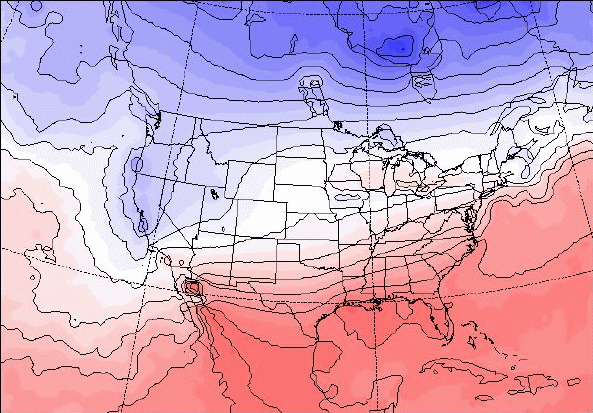
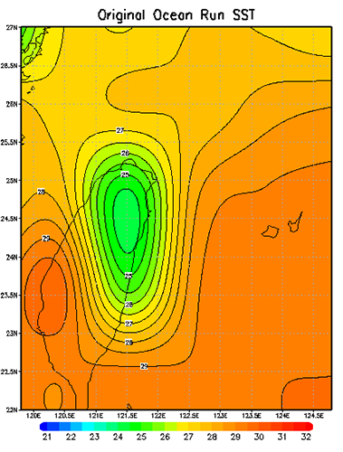
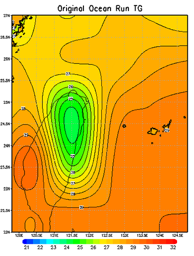
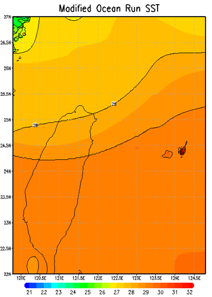
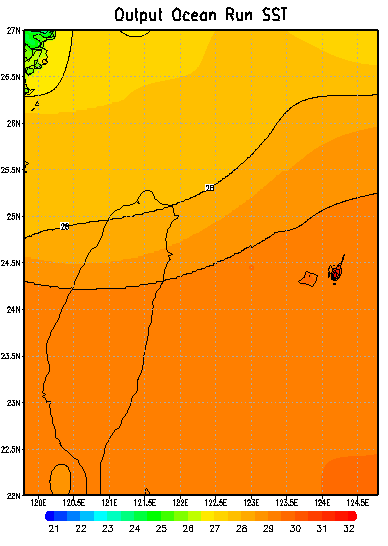
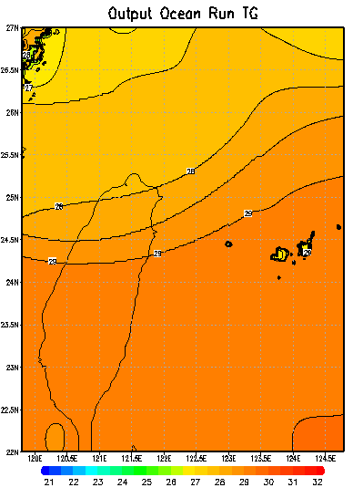
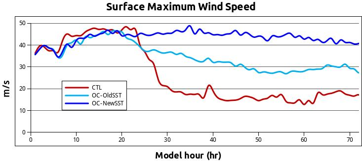

# 附錄 - 進階修改：修改 MM5 海溫資料

**以下的修改皆需要動到 MM5 內的 Fortran 程式碼，請三思而後行，此外修改後記得要重新編譯來讓變更生效。**

在進行地形敏感度數值實驗時，除了將地形移除的無地形實驗之外，也常常會進行將地表分類替換為海洋的 Ocean Run，以藉此檢驗地表特性、洋面通量對此實驗之影響。

**但是問題來了，地表分類是替換掉了，但是地表溫度呢？**

由於將地表分類替換為海洋後，經由模式自行內插出來的表面溫度（海溫）可能不合理，以台灣本島這種高聳地形為例，高山地區的地表溫度一定明顯低於洋面溫度，因此在這個假想的 Ocean Run 中，這塊原本是陸地的「海洋」會有著相對周遭海域較冷的異常區域存在，這種異常低溫的情況在海洋上不大可能出現，此時就可以修改模擬所用的海溫分布資料來讓他看起來「正常」點，然而，溫度分布又該採用哪種分布呢？長期平均？線性內插？甚至是 spline 內插？這種敏感度實驗的狀況本來就不存在於現實之中，所以選用哪種分布，甚至是不做任何改變都是可以討論的，端看你希望透過這個實驗看出什麼。

## 進行修改：
開始修改可以先看一下這張取自 MM5 OnLine Tutorial - SST Note 的海溫分布圖：


從圖中可以看到這裡的「海溫」連陸地上都有值，不過不用擔心，根據線上教學的說明陸上的值沒有任何意義，只是經由MM5自己內插產生而成的。

然而，在表面溫度（SkinTemperature）這個變數裡，則是包含了陸地、海洋的溫度資料，從下圖中可以看出兩張圖的海溫差異不大，但是在表面溫度的圖裡有表現出陸地的溫度特性來。另外由於海陸的溫差較大，在交界處也就理所當然的會有著相當大的溫度梯度。


在 REGRID 裡面對這兩個場的處理方式是一樣的，不過稍後在 INTERPF 程式中就不一樣了。

在 INTERPF 中，如果程式在讀取來自 REGIRD 的資料時有找到 SST 的資料，那就會將其存入 TSEASFC 這個變數裡，然後用他的資料當作水體的表面溫度來製作下邊界場（這個變數是可以隨時間變化的）程式也會依據**海陸分布的遮罩**自動判斷哪裡要用 SST 的資料，哪裡要用地表溫度的資料。反之，如果沒有找到 SST 的資料而只有表面溫度的資料，那就會將此表面溫度所有時間的值做平均，產生一個不隨時間變動的 TSEASFC 海溫場供模式使用，這個平均的目的就是要移除在平均的海溫場中，陸地因日夜變化而造成的溫度差異。

劈哩啪啦說了這麼多，但最關鍵的點就是：「模式會自動依據海陸遮罩，來決定哪個位置要調用海溫資料，哪個位置要調用表面溫度資料」。然而需不需要修改海溫則可以先將 MMINPUT 的資料抓出來繪圖（SST 與 TG），看看模式預處理後的結果如何：



上面這兩張海溫與地表溫度圖最明顯的差別除了溫度的不同之外，就是在地表溫度中 Domain 西北方的中國沿海以及東方的日本琉球群島上有著較高的地表溫度，而 Domain 中間的低值就是我想要修改的部分。

對這些變數有初步的了解之後就可以開始動手啦！首先要先準備好已經修改好的二進位二維海溫分佈格點資料，格點數要跟你的 domain 設定一樣（以此為例叫做 SSTok.dat，二進位檔）要準備這資料最簡單的方式就是拿原本模式輸出的的海溫資料來修改。

修改要由 INTERPF/src/modual_all_io.F 這裡開始。(供模式模擬用的海溫資料似乎是會出現在初始場資料 MMINPUT 以及邊界場資料 LOWBDY 這兩個檔案裡面)
會需要修改裡面的 add_lbc 以及 outmodel 這兩個副程式

* 若手邊沒有海溫資料，可以先在這檔案裡面加入一段程式碼讓它輸出 tseasfc 這個變數（應該是 Temperature - Sea Surface 的縮寫吧）把這裡的值改成你想要的分佈情況後再塞回來。

* 修改 add_lbc（我猜這是 add lower bounday condition 的縮寫）副程式，找到下面這段：
    ```
    WRITE ( unit_lowerbc )
    tseasfc_sh%num_dims , tseasfc_sh%start_dims ,
    tseasfc_sh%end_dims , tseasfc_sh%xtime , &
    tseasfc_sh%staggering , tseasfc_sh%ordering ,&
    tseasfc_sh%current_date , tseasfc_sh%name,&
    tseasfc_sh%units , tseasfc_sh%description
    ! 以下這個部份大概只有 i,j 需要另外宣告,tseasfc 是原本放海溫資料的地方
    !===== Overwrite SST from here by Cypresslin
    ! 修改開始
    ! I think this is for LOWBDY
    ! MMINPUT SST should be modified at subroutine outmodel for readin SST data
    open(99,file="SSTok.dat",access="direct",form="unformatted",recl=4*ie*je,status="old")
        read(99,rec=1) ((tseasfc(i,j),j=1,je),i=1,ie)
        ! 讀進新的海溫資料
        print*,"=== Modifing LOWBDY SST ==="
    close(99)
    all_2d(16)%array(is:ie,js:je)=tseasfc
    ! 隨後程式會在這把它寫入 LOWBDY 中
    ! 海溫資料在 all_2d 中是第 16 筆，在這把它放進去
    ! 修改結束
    WRITE ( unit_lowerbc ) tseasfc ! Specific things for surface air temperature small header.
    ```

若擔心海溫不是 all_2d 中第 16 筆資料的話，也可以在迴圈中加入判斷式比對 all_2d(loop)%small_header%name 是不是 TSEASFC，然後再決定要不要替換掉裡面的資料。

* 修改 outmodel，於 WRITE ( immout ) ps0 的後面加入讀取海溫資料的程式碼，作法跟前面大致一樣，如下:
    ```
    ! (這裡除了宣告 i,j 還有 tseasfc 要宣告)
    integer :: i,j
    real :: tseasfc(ie,je) ! for Read-In SST Dat
    WRITE ( immout )
    WRITE ( immout )
    num_dims , start_dims , end_dims , xtime , staggering , &
    ordering , current_date , name , units , description
    ps0
    ! Since we do not want to do lots of name checking, the easiest thing to
    ! do is pass all of the 2d fields through. We have to modify the size of
    ! the arrays (possibly) to account for the expanded / unexpanded input.
    ! 修改開始,作法跟先前一樣,讀入海溫然後替換資料
    ! Cypresslin for readin SST data
    open(99,file="SSTok.dat",access="direct",form="unformatted",recl=4*ie*je,status="old")
        read(99,rec=1) ((tseasfc(i,j),j=1,je),i=1,ie)
        print*,"=== Modifing LOWBDY SST ==="
    close(99)
    all_2d(16)%array(is:ie,js:je)=tseasfc ! 2D field number 16 is the SST field in MMINPUT
    ! 修改結束
    ! 後面就是程式自己用迴圈寫入資料了，不用管他
    DO loop = 1 , num_2d
        IF ( all_2d(loop)%small_header%ordering(1:2) .EQ. 'YX' ) THEN
        WRITE ( immout ) sh_flag
    ```

修改結束後請回到INTERPF中重新編譯。

## 驗證修改結果
在修改結束之後，強烈建議用 MM5toGrADS 等軟體將結果畫出來看看海溫的分佈是不是一如預期的那樣有成功的被修改。

以下為上面的例子中修改後的值：



這裡只有修改 SST，沒有修改 TG，所以表面溫度的圖畫出來跟前面一模一樣仍然看得到那一塊異常低溫值。不過不用擔心，就如同前面所提到的，模式會自己用海陸遮罩判斷要用哪裡的資料，當原本是陸地的地方被改成海洋之後他就會用海溫資料這樣，從模式輸出（MMOUT_DOMAIN1_00）中可以證實這一點。下面這兩張分別是海溫輸出，以及表面溫度的輸出值（請注意陸地區域的溫度）：



而在最大地表風速的強度上也一如預期有著相當顯著的差異：


That's it, have fun!
